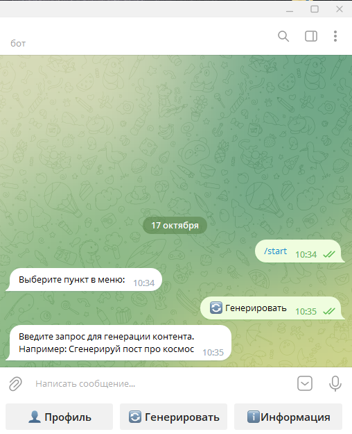
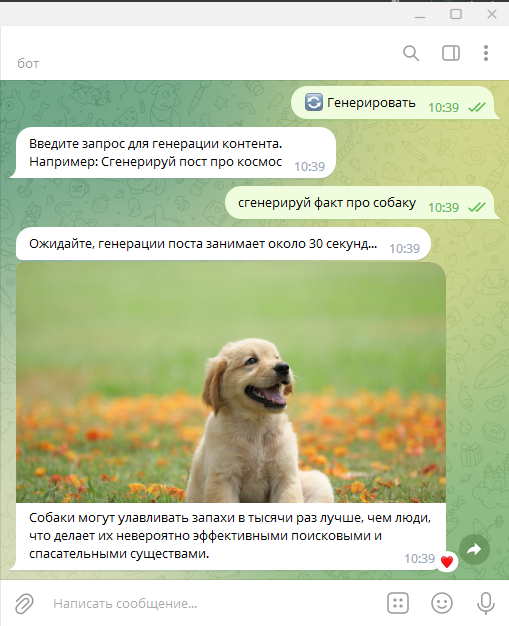

Этот бот предназначен для автоматической генерации контента для вашего Telegram-канала. Он может быстро создавать посты на основе ваших запросов, экономя ваше время и упрощая процесс администрирования каналов.

Примеры использования:

Запустите бота, отправив команду /start.
Выберите "🔄 Генерировать" для начала процесса генерации контента.
Введите запрос для генерации поста, например, "Сгенерируй пост про космос."
Бот создаст текст поста и автоматически найдет подходящее изображение для него.
Вы получите готовый пост с текстом и изображением для публикации в вашем канале.